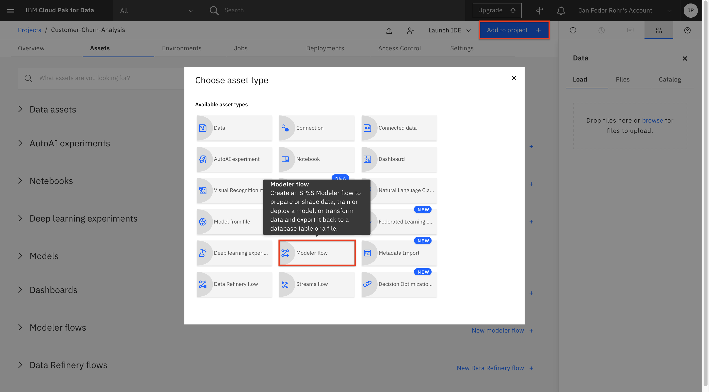
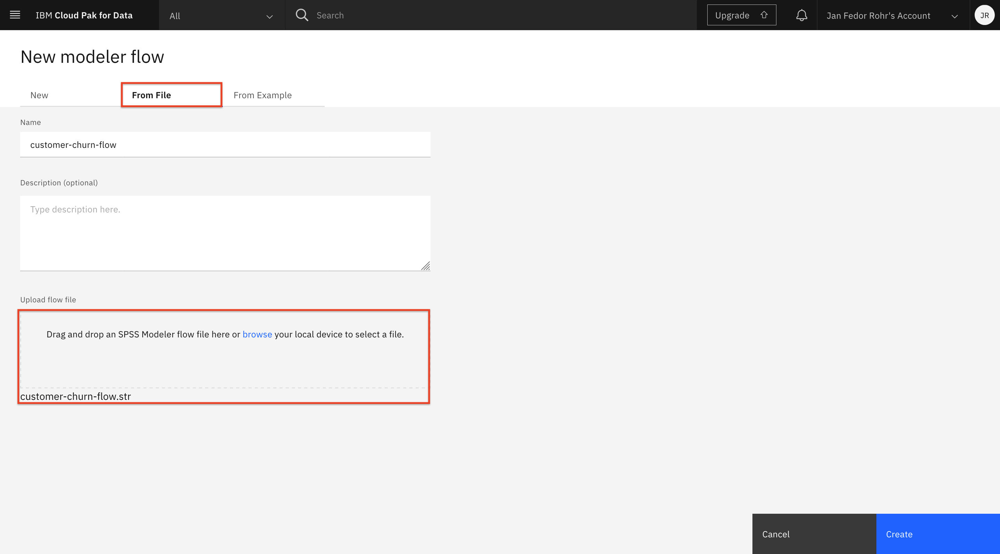
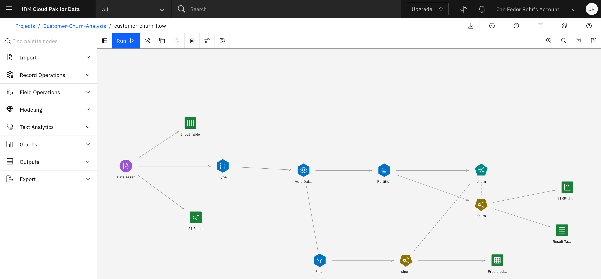

<h1 align="center" style="border-bottom: none;">:bar_chart: IBM Digital Tech Tutorial: Watson Studio Part III</h1>
<h3 align="center">In this hands-on tutorial you will graphically build and evaluate machine learning models by using the SPSS Modeler flow feature in IBM Watson Studio.</h3>

## Prerequisites

1. Sign up for an [IBM Cloud account](https://cloud.ibm.com/registration).
2. Fill in the required information and press the „Create Account“ button.
3. After you submit your registration, you will receive an e-mail from the IBM Cloud team with details about your account. In this e-mail, you will need to click the link provided to confirm your registration.
4. Now you should be able to login to your new IBM Cloud account ;-)

## Digital Tech Tutorial Watson Studio Part I to IV

This tutorial consists of 4 parts, you can start with part I or any other part, however, the necessary environment is set up in part I. 
[Part I - data visualization, preparation, and transformation](https://github.com/FelixAugenstein/digital-tech-tutorial-watson-studio) 
[Part II - build and evaluate machine learning models by using the AutoAI](https://github.com/FelixAugenstein/digital-tech-tutorial-watson-studio-part-ii/) 
[Part III - graphically build and evaluate machine learning models by using the SPSS Modeler flow](https://github.com/FelixAugenstein/digital-tech-tutorial-watson-studio-part-iii/) 
[Part IV](https://github.com/FelixAugenstein/digital-tech-tutorial-watson-studio-part-iv/)

The 4 parts of this tutorial are based on the [Learning path: Getting started with Watson Studio](https://developer.ibm.com/series/learning-path-watson-studio/).

## Create model flow

To create an initial machine learning flow:

1. From the Assets page, click Add to project.
2. In the Choose asset type page, select Modeler Flow.

3. On the Modeler page, select the ‘From File’ tab.
4. Download the model flow that is named ‘customer-churn-flow.str’ from this repository.
5. Drag the downloaded modeler flow file to the upload area or browse for it. This also sets the name for the flow.

6. Change the name and provide a description for the machine learning flow (optional).
7. Click Create. This opens the Flow Editor that can be used to create a machine learning flow.

You have now imported an initial flow that we’ll explore in the rest of this tutorial.

Under the Modeling drop-down menu, you can see the various supported modeling techniques. The first one is Auto Classifier, which tries several techniques and then presents the results of the best one.

The main flow itself defines a pipeline consisting of several steps:

- A Data Asset node for importing the data set
- A Type node for defining metadata for the features, including a selection of the target attributes for the classification
- An Auto Data Prep node for preparing the data for modeling
- A Partition node for partitioning the data into a training set and a testing set
- An Auto Classifier node called ‘churn’ for creating and evaluating the model

Additional nodes have been associated with the main pipeline for viewing the input and output. These are:
- A Table output node called ‘Input Table’ for previewing the input data
- A Data Audit node called ’21 fields’ (default name) for auditing the quality of the input data set (min, max, standard, and deviation)
- An Evaluation node for evaluating the generated model
- A Table output node called ‘Result Table’ for previewing the results of the test prediction

Other input and output types can be viewed by selecting the Outputs drop-down menu.

## Assign data asset and run the flow

Text

## Understanding the data

Text

## Data preparation

Text

## Training the model

Text

## Evaluating the model

Text

## Saving and deploying the model

Text

## Testing the model

Text

## If you have any questions just contact me
Felix Augenstein 
Digital Tech Ecosystem & Developer Representative @IBM 
Twitter: [@F_Augenstein](https://twitter.com/F_Augenstein) 
LinkedIn: [linkedin.com/in/felixaugenstein](https://www.linkedin.com/in/felixaugenstein/)
